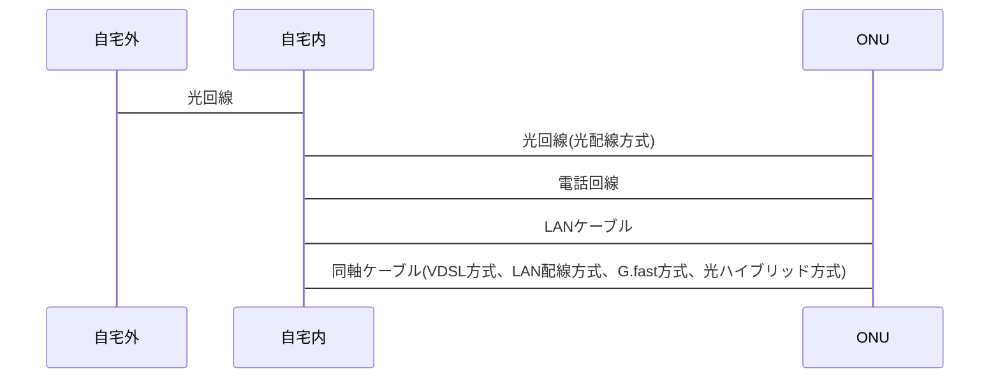

# network全般

## 光回線

物理的な光回線は大きく分けて3つから引かれている

- NTT系
- 電力会社系
- CATV系

### NTT系

いわゆるコラボ光、NTTからフレッツ光を降ろしてもらいプロバイダーと回線を一体提供している(〇〇光など)
10Gbpsのときはフレッツ光クロスという名称になる

### 電力会社系

eo光とかコミュファ光とか

### CATV(ケーブルテレビ)系

jcomとか、宅内配線は同軸ケーブル多し

### 例外

NURO光…NTT系の派生
auひかり…NTT系、電力系の派生

## 配線方式について

ONUまで光回線まできているのは光配線方式
自宅まで光回線まできていて自宅内からONUまでは別方式のものがある

## 用語

簡易的な説明のみ、詳しくは検索すること

- IPv6 IPoE…
- PPPoE…PPPoEはPPP (Point-to-Point Protocol)という通信方式をイーサネット上で利用したもの。事業者からのIDとpassword発行が必要。トンネル接続方式ともいう。コミュファ光で使ってる
- NGN網…
- IPoE…ネイティブ接続方式ともいう。IDとpassword不要。
- IPv4 over IPv6…
