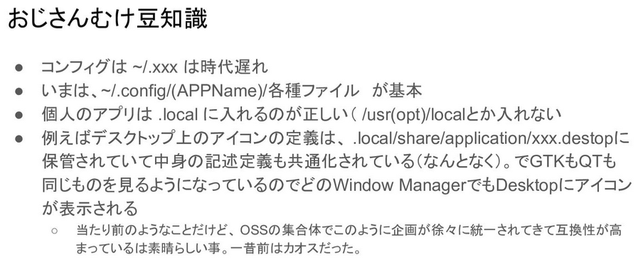

# OS関係

>[今どきのLinux事情](https://speakerdeck.com/tokida/jin-dokifalselinuxshi-qing)



ディレクトリ説明
>[【Linux】初学者が知っておきたい、アレとか、コレとか……](https://qiita.com/YSWEngineer/items/52370b37486f5907fc87#%E3%83%95%E3%82%A1%E3%82%A4%E3%83%AB%E3%83%95%E3%82%A9%E3%83%AB%E3%83%80%E3%83%87%E3%82%A3%E3%83%AC%E3%82%AF%E3%83%88%E3%83%AA)

| ディレクトリ | 役割 |
|:---|:---|
|/（ルートディレクトリ）|  ディレクトリの最上位に位置し、すべてのファイルとディレクトリの起点となっています。|
|/bin(ビン) | 基本的なコマンドが含まれるディレクトリです。例えばlsコマンドやcpコマンドなどのコマンドがここにあります。binはbinaryの略です。|
|/boot(ブート)|  システムの起動に関する重要なファイルがここにあります。ユーザーはこのディレクトリを操作するようなことは殆どありません。|
|/dev(デヴ) | デバイスファイルが格納されているディレクトリです。デバイスファイルとはマウスやモニターといったハードウェア機器をファイル化した表したものです。devはdeviceの略です。|
|/etc(エトセ) | OSなどのシステム全体の設定ファイルが格納されているディレクトリです。設定ファイルがあるのでとても重要なディレクトリです。etcはetceteraの略です。|
|/home | ユーザーのホームディレクトリが格納されているディレクトリです。ホームディレクトリはLinuxにログインした時の最初の場所となるディレクトリのことです。|
|/lib(リブ、ライブラリ)|  OSに必要なライブラリファイルが格納されているディレクトリです。ライブラリファイルとはたくさんのプログラムで共有されて使われている特別なファイルで、プログラムが動くために必要な機能やコードが詰まっています。libはlibraryの略です。|
|/media | 外部ディスクなどの記憶媒体をLinuxで使用可能にするための登録をシステムが自動で行うためのディレクトリです。|
|/mnt(マウント) | 外部ディスクなどの記憶媒体をLinuxで使用可能にするための登録をユーザーが手動で行うためのディレクトリです。mntはmountの略で、mountとは外部ディスクなどの記憶媒体をLinuxで使用可能にするために登録することを意味します。|
|/opt(オプション) | 追加のアプリケーションが格納されているディレクトリです。例えば、Chromeなどのサードパーティアプリケーションをインストールする場所がこの/optです。optはoptionの略です。|
|/proc(プロック)|  カーネルなどのOSに関連する情報が格納されているディレクトリです。OSのシステムをコントロールするために使われます。|
|/root(ルート)|  システムの管理者であるrootユーザーのホームディレクトリです。ルートディレクトリ「/」とは別物なので注意してください。|
|/sbin(エスビン) | システムの管理者であるrootユーザーのみが実行できるコマンドが含まれているディレクトリです。システムの管理や設定に必要なコマンドがここにあります。sbinはsystem binaryの略です。|
|/sys(シス)|  OSの現在の状況に関する情報が格納されているディレクトリです。|
|/usr(ユーザー)|  全ユーザーが共通して利用するプログラムやライブラリのデータが格納されているディレクトリです。|
|/var(バー) | ログファイルが格納されているディレクトリです。ログファイルは、コンピューターの動作やアプリケーションの動きを記録するためのファイルです。varはvariableの略です。|

## ubuntuリポジトリ

- main：Canonicalが公式にセキュリティアップデートを提供するソフトウェアで、おおよそフリーソフトウェアなライセンスで構成される
- universe：コミュニティがセキュリティアップデートを提供するソフトウェアで、おおよそフリーソフトウェアなライセンスで構成される
- restricted：フリーソフトウェアではないものの、デバイスを動かすためには必要なソフトウェア
multiverse: ライセンスや法律的な制約があるソフトウェア

## ユニバーサルパッケージングシステム

「どのLinuxディストリビューション・どのリリースでも使える統一的なパッケージフォーマットを作ろう」という試み

- Debian系だとdebファイル,ubuntuはココ
- RHEL系だとrpmファイル

>[バージョンフォーマット](https://pc.watch.impress.co.jp/docs/column/ubuntu/1417585.html)


下は手元のubuntuで```apt update && apt list --upgradable```した例

```openssl/oldoldstable 1.1.1n-0+deb10u6 amd64 [upgradable from: 1.1.1n-0+deb10u5]```

openssl…ライブラリ名
oldoldstable…Debianディストリビューションのリリースバージョン名
0+deb10u6…"deb10" はDebianのリリースコードネーム、"u6"バージョンのアップデート番号
amd64…amd64は64ビットアーキテクチャ
